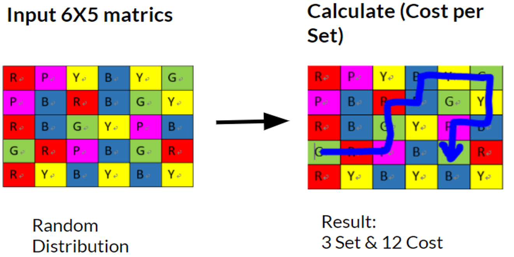

# Mobile_game_path_finding_algorithm

I did this project when I was in University.

**Project Idea**

It is kind of puzzle game, try to find the most efficient path to get the best result (to solve the problem)

This project we implement A* algorithm & exhaust method, do the comparison.

[A* algorithm](https://en.wikipedia.org/wiki/A*_search_algorithm)

**Evaluate function**

How to evaluate the program? I had two ideas.

First, using everage combo(score) / cost(step numbeers) rate to evaluate.

Scound, just compare who can get the most combom.

**Some thought to solve this problem**

