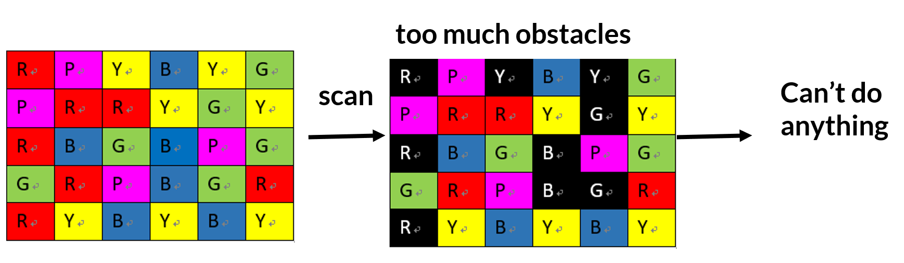
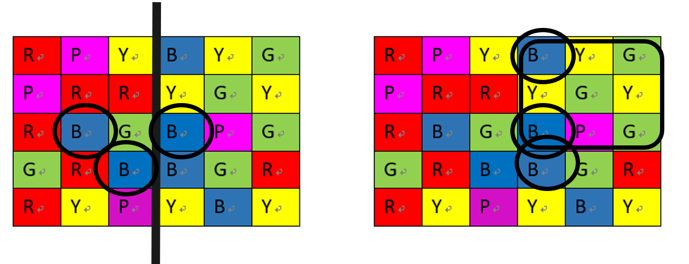
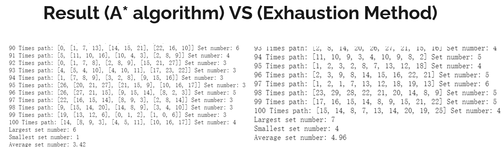

# Mobile_game_path_finding_algorithm

I did this project when I was in University.

**Project Idea**

It is kind of puzzle game, try to find the most efficient path to get the best result (to solve the problem)

This project we implement A* algorithm & exhaust method, do the comparison.

[A* algorithm](https://en.wikipedia.org/wiki/A*_search_algorithm)

**Evaluate function**

How to evaluate the program? I had two ideas.

First, using everage combo(score) / cost(step numbeers) rate to evaluate.

Scound, just compare who can get the most combom.

**Some thought to solve this problem**

The first method we thought was "Scanning the whole picture first, and decide which location is the obstacle, then we may get the path."
However, there is a problem, sometimes, the obstacles number will be too many to do anything.

The second method is to do kind of divide and conquer, solve the problem from the small scale.
However, the problem is, the original scale (6X5) isn't so big. So if we do that divide and conquer the separate function isn't that efficient,
And sometimes, we may separe the set cross the to area.

**result**

Due to the scale of this puzzle game isn't too large, two method has their pros and cons.

A* algorithm process faster and can get a fine answer, not the best. 

(The reason is the start point choosing) we didn't have a good start point choosing function. The start point choose randomly. Best place may get higher score.

Exhaust method process slower, but because it scans everything, so it can get the best result, the every set is high.

**result** DO 100 times to get a average combo number.

